# Projects and dependencies analysis

This document provides a comprehensive overview of the projects and their dependencies in the context of upgrading to .NETCoreApp,Version=v10.0.

## Table of Contents

- [Executive Summary](#executive-Summary)
  - [Highlevel Metrics](#highlevel-metrics)
  - [Projects Compatibility](#projects-compatibility)
  - [Package Compatibility](#package-compatibility)
  - [API Compatibility](#api-compatibility)
  - [Binding Redirect Configuration](#binding-redirect-configuration)
- [Aggregate NuGet packages details](#aggregate-nuget-packages-details)
- [Top API Migration Challenges](#top-api-migration-challenges)
  - [Technologies and Features](#technologies-and-features)
  - [Most Frequent API Issues](#most-frequent-api-issues)
- [Projects Relationship Graph](#projects-relationship-graph)
- [Project Details](#project-details)

  - [src\Kinetq.LiquidPages.AspNetCore.Sample\Kinetq.LiquidPages.AspNetCore.Sample.csproj](#srckinetqliquidpagesaspnetcoresamplekinetqliquidpagesaspnetcoresamplecsproj)
  - [src\Kinetq.LiquidPages.AspNetCore\Kinetq.LiquidPages.AspNetCore.csproj](#srckinetqliquidpagesaspnetcorekinetqliquidpagesaspnetcorecsproj)
  - [src\Kinetq.LiquidPages.Avalonia.Sample\Kinetq.LiquidPages.Avalonia.Sample.csproj](#srckinetqliquidpagesavaloniasamplekinetqliquidpagesavaloniasamplecsproj)
  - [src\Kinetq.LiquidPages.EmbedIO.Sample\Kinetq.LiquidPages.EmbedIO.Sample.csproj](#srckinetqliquidpagesembediosamplekinetqliquidpagesembediosamplecsproj)
  - [src\Kinetq.LiquidPages.EmbedIO.Tests\Kinetq.LiquidPages.EmbedIO.Tests.csproj](#srckinetqliquidpagesembediotestskinetqliquidpagesembediotestscsproj)
  - [src\Kinetq.LiquidPages.EmbedIO\Kinetq.LiquidPages.EmbedIO.csproj](#srckinetqliquidpagesembediokinetqliquidpagesembediocsproj)
  - [src\Kinetq.LiquidPages.Extension\Kinetq.LiquidPages.Extension.csproj](#srckinetqliquidpagesextensionkinetqliquidpagesextensioncsproj)
  - [src\Kinetq.LiquidPages.GenHTTP.Sample\Kinetq.LiquidPages.GenHTTP.Sample.csproj](#srckinetqliquidpagesgenhttpsamplekinetqliquidpagesgenhttpsamplecsproj)
  - [src\Kinetq.LiquidPages.GenHTTP.Tests\Kinetq.LiquidPages.GenHTTP.Tests.csproj](#srckinetqliquidpagesgenhttptestskinetqliquidpagesgenhttptestscsproj)
  - [src\Kinetq.LiquidPages.GenHTTP\Kinetq.LiquidPages.GenHTTP.csproj](#srckinetqliquidpagesgenhttpkinetqliquidpagesgenhttpcsproj)
  - [src\Kinetq.LiquidPages.RazorPages.Sample\Kinetq.LiquidPages.RazorPages.Sample.csproj](#srckinetqliquidpagesrazorpagessamplekinetqliquidpagesrazorpagessamplecsproj)
  - [src\Kinetq.LiquidPages.Router\Kinetq.LiquidPages.Router.csproj](#srckinetqliquidpagesrouterkinetqliquidpagesroutercsproj)
  - [src\Kinetq.LiquidPages.SimpleW.Razor.Sample\Kinetq.LiquidPages.SimpleW.Razor.Sample.csproj](#srckinetqliquidpagessimplewrazorsamplekinetqliquidpagessimplewrazorsamplecsproj)
  - [src\Kinetq.LiquidPages.SimpleW.Sample\Kinetq.LiquidPages.SimpleW.Sample.csproj](#srckinetqliquidpagessimplewsamplekinetqliquidpagessimplewsamplecsproj)
  - [src\Kinetq.LiquidPages.SimpleW.Tests\Kinetq.LiquidPages.SimpleW.Tests.csproj](#srckinetqliquidpagessimplewtestskinetqliquidpagessimplewtestscsproj)
  - [src\Kinetq.LiquidPages.SimpleW\Kinetq.LiquidPages.SimpleW.csproj](#srckinetqliquidpagessimplewkinetqliquidpagessimplewcsproj)
  - [src\Kinetq.LiquidPages.Templates\Kinetq.LiquidPages.Templates.csproj](#srckinetqliquidpagestemplateskinetqliquidpagestemplatescsproj)
  - [src\Kinetq.LiquidPages.Tests\Kinetq.LiquidPages.Tests.csproj](#srckinetqliquidpagestestskinetqliquidpagestestscsproj)
  - [src\Kinetq.LiquidPages\Kinetq.LiquidPages.csproj](#srckinetqliquidpageskinetqliquidpagescsproj)

## Executive Summary

### Highlevel Metrics

| Metric | Count | Status |
| :--- | :---: | :--- |
| Total Projects | 19 | All require upgrade |
| Total NuGet Packages | 33 | 13 need upgrade |
| Total Code Files | 133 |  |
| Total Code Files with Incidents | 47 |  |
| Total Lines of Code | 6630 |  |
| Total Number of Issues | 183 |  |
| Estimated LOC to modify | 142+ | at least 2.1% of codebase |

### Projects Compatibility

| Project | Target Framework | Difficulty | Package Issues | API Issues | Binding Issues | Est. LOC Impact | Description |
| :--- | :---: | :---: | :---: | :---: | :---: | :---: | :--- |
| [src\Kinetq.LiquidPages.AspNetCore.Sample\Kinetq.LiquidPages.AspNetCore.Sample.csproj](#srckinetqliquidpagesaspnetcoresamplekinetqliquidpagesaspnetcoresamplecsproj) | net9.0 | 🟢 Low | 0 | 0 | 0 |  | AspNetCore, Sdk Style = True |
| [src\Kinetq.LiquidPages.AspNetCore\Kinetq.LiquidPages.AspNetCore.csproj](#srckinetqliquidpagesaspnetcorekinetqliquidpagesaspnetcorecsproj) | net9.0 | 🟢 Low | 0 | 1 | 0 | 1+ | ClassLibrary, Sdk Style = True |
| [src\Kinetq.LiquidPages.Avalonia.Sample\Kinetq.LiquidPages.Avalonia.Sample.csproj](#srckinetqliquidpagesavaloniasamplekinetqliquidpagesavaloniasamplecsproj) | net9.0-windows10.0.19041.0 | 🟢 Low | 2 | 113 | 0 | 113+ | WinForms, Sdk Style = True |
| [src\Kinetq.LiquidPages.EmbedIO.Sample\Kinetq.LiquidPages.EmbedIO.Sample.csproj](#srckinetqliquidpagesembediosamplekinetqliquidpagesembediosamplecsproj) | net9.0 | 🟢 Low | 1 | 1 | 0 | 1+ | DotNetCoreApp, Sdk Style = True |
| [src\Kinetq.LiquidPages.EmbedIO.Tests\Kinetq.LiquidPages.EmbedIO.Tests.csproj](#srckinetqliquidpagesembediotestskinetqliquidpagesembediotestscsproj) | net9.0 | 🟢 Low | 2 | 0 | 0 |  | DotNetCoreApp, Sdk Style = True |
| [src\Kinetq.LiquidPages.EmbedIO\Kinetq.LiquidPages.EmbedIO.csproj](#srckinetqliquidpagesembediokinetqliquidpagesembediocsproj) | net9.0 | 🟢 Low | 0 | 3 | 0 | 3+ | ClassLibrary, Sdk Style = True |
| [src\Kinetq.LiquidPages.Extension\Kinetq.LiquidPages.Extension.csproj](#srckinetqliquidpagesextensionkinetqliquidpagesextensioncsproj) | net8.0-windows8.0 | 🟢 Low | 0 | 11 | 0 | 11+ | ClassLibrary, Sdk Style = True |
| [src\Kinetq.LiquidPages.GenHTTP.Sample\Kinetq.LiquidPages.GenHTTP.Sample.csproj](#srckinetqliquidpagesgenhttpsamplekinetqliquidpagesgenhttpsamplecsproj) | net9.0 | 🟢 Low | 1 | 1 | 0 | 1+ | DotNetCoreApp, Sdk Style = True |
| [src\Kinetq.LiquidPages.GenHTTP.Tests\Kinetq.LiquidPages.GenHTTP.Tests.csproj](#srckinetqliquidpagesgenhttptestskinetqliquidpagesgenhttptestscsproj) | net9.0 | 🟢 Low | 2 | 0 | 0 |  | DotNetCoreApp, Sdk Style = True |
| [src\Kinetq.LiquidPages.GenHTTP\Kinetq.LiquidPages.GenHTTP.csproj](#srckinetqliquidpagesgenhttpkinetqliquidpagesgenhttpcsproj) | net9.0 | 🟢 Low | 0 | 2 | 0 | 2+ | ClassLibrary, Sdk Style = True |
| [src\Kinetq.LiquidPages.RazorPages.Sample\Kinetq.LiquidPages.RazorPages.Sample.csproj](#srckinetqliquidpagesrazorpagessamplekinetqliquidpagesrazorpagessamplecsproj) | net9.0 | 🟢 Low | 0 | 1 | 0 | 1+ | AspNetCore, Sdk Style = True |
| [src\Kinetq.LiquidPages.Router\Kinetq.LiquidPages.Router.csproj](#srckinetqliquidpagesrouterkinetqliquidpagesroutercsproj) | net9.0 | 🟢 Low | 0 | 0 | 0 |  | ClassLibrary, Sdk Style = True |
| [src\Kinetq.LiquidPages.SimpleW.Razor.Sample\Kinetq.LiquidPages.SimpleW.Razor.Sample.csproj](#srckinetqliquidpagessimplewrazorsamplekinetqliquidpagessimplewrazorsamplecsproj) | net9.0 | 🟢 Low | 0 | 1 | 0 | 1+ | DotNetCoreApp, Sdk Style = True |
| [src\Kinetq.LiquidPages.SimpleW.Sample\Kinetq.LiquidPages.SimpleW.Sample.csproj](#srckinetqliquidpagessimplewsamplekinetqliquidpagessimplewsamplecsproj) | net9.0 | 🟢 Low | 0 | 2 | 0 | 2+ | DotNetCoreApp, Sdk Style = True |
| [src\Kinetq.LiquidPages.SimpleW.Tests\Kinetq.LiquidPages.SimpleW.Tests.csproj](#srckinetqliquidpagessimplewtestskinetqliquidpagessimplewtestscsproj) | net9.0 | 🟢 Low | 2 | 0 | 0 |  | DotNetCoreApp, Sdk Style = True |
| [src\Kinetq.LiquidPages.SimpleW\Kinetq.LiquidPages.SimpleW.csproj](#srckinetqliquidpagessimplewkinetqliquidpagessimplewcsproj) | net9.0 | 🟢 Low | 1 | 0 | 0 |  | ClassLibrary, Sdk Style = True |
| [src\Kinetq.LiquidPages.Templates\Kinetq.LiquidPages.Templates.csproj](#srckinetqliquidpagestemplateskinetqliquidpagestemplatescsproj) | net9.0 | 🟢 Low | 0 | 0 | 0 |  | ClassLibrary, Sdk Style = True |
| [src\Kinetq.LiquidPages.Tests\Kinetq.LiquidPages.Tests.csproj](#srckinetqliquidpagestestskinetqliquidpagestestscsproj) | net9.0 | 🟢 Low | 2 | 4 | 0 | 4+ | DotNetCoreApp, Sdk Style = True |
| [src\Kinetq.LiquidPages\Kinetq.LiquidPages.csproj](#srckinetqliquidpageskinetqliquidpagescsproj) | net9.0 | 🟢 Low | 9 | 2 | 0 | 2+ | ClassLibrary, Sdk Style = True |

### Package Compatibility

| Status | Count | Percentage |
| :--- | :---: | :---: |
| ✅ Compatible | 20 | 60.6% |
| ⚠️ Incompatible | 1 | 3.0% |
| 🔄 Upgrade Recommended | 12 | 36.4% |
| ***Total NuGet Packages*** | ***33*** | ***100%*** |

### API Compatibility

| Category | Count | Impact |
| :--- | :---: | :--- |
| 🔴 Binary Incompatible | 0 | High - Require code changes |
| 🟡 Source Incompatible | 111 | Medium - Needs re-compilation and potential conflicting API error fixing |
| 🔵 Behavioral change | 31 | Low - Behavioral changes that may require testing at runtime |
| ✅ Compatible | 9450 |  |
| ***Total APIs Analyzed*** | ***9592*** |  |

## Aggregate NuGet packages details

| Package | Current Version | Suggested Version | Projects | Description |
| :--- | :---: | :---: | :--- | :--- |
| coverlet.collector | 6.0.2 |  | [Kinetq.LiquidPages.EmbedIO.Tests.csproj](#srckinetqliquidpagesembediotestskinetqliquidpagesembediotestscsproj) [Kinetq.LiquidPages.GenHTTP.Tests.csproj](#srckinetqliquidpagesgenhttptestskinetqliquidpagesgenhttptestscsproj) [Kinetq.LiquidPages.SimpleW.Tests.csproj](#srckinetqliquidpagessimplewtestskinetqliquidpagessimplewtestscsproj) [Kinetq.LiquidPages.Tests.csproj](#srckinetqliquidpagestestskinetqliquidpagestestscsproj) | ✅Compatible |
| EmbedIO | 3.5.2 |  | [Kinetq.LiquidPages.EmbedIO.csproj](#srckinetqliquidpagesembediokinetqliquidpagesembediocsproj) | ✅Compatible |
| FluentAssertions | 8.8.0 |  | [Kinetq.LiquidPages.EmbedIO.Tests.csproj](#srckinetqliquidpagesembediotestskinetqliquidpagesembediotestscsproj) [Kinetq.LiquidPages.GenHTTP.Tests.csproj](#srckinetqliquidpagesgenhttptestskinetqliquidpagesgenhttptestscsproj) [Kinetq.LiquidPages.SimpleW.Tests.csproj](#srckinetqliquidpagessimplewtestskinetqliquidpagessimplewtestscsproj) [Kinetq.LiquidPages.Tests.csproj](#srckinetqliquidpagestestskinetqliquidpagestestscsproj) | ✅Compatible |
| Fluid.Core | 2.31.0 |  | [Kinetq.LiquidPages.csproj](#srckinetqliquidpageskinetqliquidpagescsproj) | ✅Compatible |
| GenHTTP.Api | 10.5.3 |  | [Kinetq.LiquidPages.GenHTTP.csproj](#srckinetqliquidpagesgenhttpkinetqliquidpagesgenhttpcsproj) | ✅Compatible |
| GenHTTP.Core | 10.5.3 |  | [Kinetq.LiquidPages.GenHTTP.Sample.csproj](#srckinetqliquidpagesgenhttpsamplekinetqliquidpagesgenhttpsamplecsproj) [Kinetq.LiquidPages.GenHTTP.Tests.csproj](#srckinetqliquidpagesgenhttptestskinetqliquidpagesgenhttptestscsproj) | ✅Compatible |
| GenHTTP.Modules.IO | 10.5.3 |  | [Kinetq.LiquidPages.GenHTTP.Sample.csproj](#srckinetqliquidpagesgenhttpsamplekinetqliquidpagesgenhttpsamplecsproj) | ✅Compatible |
| GenHTTP.Modules.Layouting | 10.5.3 |  | [Kinetq.LiquidPages.GenHTTP.csproj](#srckinetqliquidpagesgenhttpkinetqliquidpagesgenhttpcsproj) | ✅Compatible |
| Microsoft.AspNetCore.Http.Abstractions | 2.3.10 |  | [Kinetq.LiquidPages.AspNetCore.csproj](#srckinetqliquidpagesaspnetcorekinetqliquidpagesaspnetcorecsproj) | ✅Compatible |
| Microsoft.CodeAnalysis.CSharp.Workspaces | 4.11.0 |  | [Kinetq.LiquidPages.Extension.csproj](#srckinetqliquidpagesextensionkinetqliquidpagesextensioncsproj) | ✅Compatible |
| Microsoft.CodeAnalysis.Workspaces.Common | 4.11.0 |  | [Kinetq.LiquidPages.Extension.csproj](#srckinetqliquidpagesextensionkinetqliquidpagesextensioncsproj) | ✅Compatible |
| Microsoft.Extensions.Configuration | 10.0.1 | 10.0.9 | [Kinetq.LiquidPages.csproj](#srckinetqliquidpageskinetqliquidpagescsproj) | NuGet package upgrade is recommended |
| Microsoft.Extensions.Configuration.Binder | 10.0.1 | 10.0.9 | [Kinetq.LiquidPages.csproj](#srckinetqliquidpageskinetqliquidpagescsproj) | NuGet package upgrade is recommended |
| Microsoft.Extensions.DependencyInjection | 10.0.1 | 10.0.9 | [Kinetq.LiquidPages.csproj](#srckinetqliquidpageskinetqliquidpagescsproj) | NuGet package upgrade is recommended |
| Microsoft.Extensions.FileProviders.Abstractions | 10.0.1 | 10.0.9 | [Kinetq.LiquidPages.csproj](#srckinetqliquidpageskinetqliquidpagescsproj) | NuGet package upgrade is recommended |
| Microsoft.Extensions.FileProviders.Composite | 10.0.1 | 10.0.9 | [Kinetq.LiquidPages.csproj](#srckinetqliquidpageskinetqliquidpagescsproj) | NuGet package upgrade is recommended |
| Microsoft.Extensions.FileProviders.Embedded | 10.0.1 | 10.0.9 | [Kinetq.LiquidPages.csproj](#srckinetqliquidpageskinetqliquidpagescsproj) | NuGet package upgrade is recommended |
| Microsoft.Extensions.FileProviders.Physical | 10.0.1 | 10.0.9 | [Kinetq.LiquidPages.csproj](#srckinetqliquidpageskinetqliquidpagescsproj) | NuGet package upgrade is recommended |
| Microsoft.Extensions.Logging.Abstractions | 10.0.1 | 10.0.9 | [Kinetq.LiquidPages.csproj](#srckinetqliquidpageskinetqliquidpagescsproj) | NuGet package upgrade is recommended |
| Microsoft.Extensions.Logging.Console | 10.0.1 | 10.0.9 | [Kinetq.LiquidPages.EmbedIO.Tests.csproj](#srckinetqliquidpagesembediotestskinetqliquidpagesembediotestscsproj) [Kinetq.LiquidPages.GenHTTP.Tests.csproj](#srckinetqliquidpagesgenhttptestskinetqliquidpagesgenhttptestscsproj) [Kinetq.LiquidPages.Tests.csproj](#srckinetqliquidpagestestskinetqliquidpagestestscsproj) | NuGet package upgrade is recommended |
| Microsoft.Extensions.Logging.Console | 10.0.2 | 10.0.9 | [Kinetq.LiquidPages.Avalonia.Sample.csproj](#srckinetqliquidpagesavaloniasamplekinetqliquidpagesavaloniasamplecsproj) [Kinetq.LiquidPages.EmbedIO.Sample.csproj](#srckinetqliquidpagesembediosamplekinetqliquidpagesembediosamplecsproj) [Kinetq.LiquidPages.GenHTTP.Sample.csproj](#srckinetqliquidpagesgenhttpsamplekinetqliquidpagesgenhttpsamplecsproj) [Kinetq.LiquidPages.SimpleW.csproj](#srckinetqliquidpagessimplewkinetqliquidpagessimplewcsproj) [Kinetq.LiquidPages.SimpleW.Tests.csproj](#srckinetqliquidpagessimplewtestskinetqliquidpagessimplewtestscsproj) | NuGet package upgrade is recommended |
| Microsoft.Extensions.Logging.Debug | 10.0.0 | 10.0.9 | [Kinetq.LiquidPages.Avalonia.Sample.csproj](#srckinetqliquidpagesavaloniasamplekinetqliquidpagesavaloniasamplecsproj) | NuGet package upgrade is recommended |
| Microsoft.Extensions.Options | 10.0.1 | 10.0.9 | [Kinetq.LiquidPages.csproj](#srckinetqliquidpageskinetqliquidpagescsproj) | NuGet package upgrade is recommended |
| Microsoft.IO.RecyclableMemoryStream | 3.0.1 |  | [Kinetq.LiquidPages.AspNetCore.csproj](#srckinetqliquidpagesaspnetcorekinetqliquidpagesaspnetcorecsproj) | ✅Compatible |
| Microsoft.Maui.Controls | 10.0.80 |  | [Kinetq.LiquidPages.Avalonia.Sample.csproj](#srckinetqliquidpagesavaloniasamplekinetqliquidpagesavaloniasamplecsproj) | ✅Compatible |
| Microsoft.NET.Test.Sdk | 17.12.0 |  | [Kinetq.LiquidPages.EmbedIO.Tests.csproj](#srckinetqliquidpagesembediotestskinetqliquidpagesembediotestscsproj) [Kinetq.LiquidPages.GenHTTP.Tests.csproj](#srckinetqliquidpagesgenhttptestskinetqliquidpagesgenhttptestscsproj) [Kinetq.LiquidPages.SimpleW.Tests.csproj](#srckinetqliquidpagessimplewtestskinetqliquidpagessimplewtestscsproj) [Kinetq.LiquidPages.Tests.csproj](#srckinetqliquidpagestestskinetqliquidpagestestscsproj) | ✅Compatible |
| Microsoft.VisualStudio.Extensibility.Build | 17.14.40608 |  | [Kinetq.LiquidPages.Extension.csproj](#srckinetqliquidpagesextensionkinetqliquidpagesextensioncsproj) | ✅Compatible |
| Microsoft.VisualStudio.Extensibility.Sdk | 17.14.40608 |  | [Kinetq.LiquidPages.Extension.csproj](#srckinetqliquidpagesextensionkinetqliquidpagesextensioncsproj) | ✅Compatible |
| Moq | 4.20.72 |  | [Kinetq.LiquidPages.EmbedIO.Tests.csproj](#srckinetqliquidpagesembediotestskinetqliquidpagesembediotestscsproj) [Kinetq.LiquidPages.GenHTTP.Tests.csproj](#srckinetqliquidpagesgenhttptestskinetqliquidpagesgenhttptestscsproj) [Kinetq.LiquidPages.SimpleW.Tests.csproj](#srckinetqliquidpagessimplewtestskinetqliquidpagessimplewtestscsproj) [Kinetq.LiquidPages.Tests.csproj](#srckinetqliquidpagestestskinetqliquidpagestestscsproj) | ✅Compatible |
| SimpleW | 26.0.1 |  | [Kinetq.LiquidPages.SimpleW.csproj](#srckinetqliquidpagessimplewkinetqliquidpagessimplewcsproj) [Kinetq.LiquidPages.SimpleW.Razor.Sample.csproj](#srckinetqliquidpagessimplewrazorsamplekinetqliquidpagessimplewrazorsamplecsproj) | ✅Compatible |
| SimpleW.Helper.Razor | 26.0.0 |  | [Kinetq.LiquidPages.SimpleW.Razor.Sample.csproj](#srckinetqliquidpagessimplewrazorsamplekinetqliquidpagessimplewrazorsamplecsproj) | ✅Compatible |
| xunit | 2.9.2 |  | [Kinetq.LiquidPages.EmbedIO.Tests.csproj](#srckinetqliquidpagesembediotestskinetqliquidpagesembediotestscsproj) [Kinetq.LiquidPages.GenHTTP.Tests.csproj](#srckinetqliquidpagesgenhttptestskinetqliquidpagesgenhttptestscsproj) [Kinetq.LiquidPages.SimpleW.Tests.csproj](#srckinetqliquidpagessimplewtestskinetqliquidpagessimplewtestscsproj) [Kinetq.LiquidPages.Tests.csproj](#srckinetqliquidpagestestskinetqliquidpagestestscsproj) | ⚠️NuGet package is deprecated |
| xunit.runner.visualstudio | 2.8.2 |  | [Kinetq.LiquidPages.EmbedIO.Tests.csproj](#srckinetqliquidpagesembediotestskinetqliquidpagesembediotestscsproj) [Kinetq.LiquidPages.GenHTTP.Tests.csproj](#srckinetqliquidpagesgenhttptestskinetqliquidpagesgenhttptestscsproj) [Kinetq.LiquidPages.SimpleW.Tests.csproj](#srckinetqliquidpagessimplewtestskinetqliquidpagessimplewtestscsproj) [Kinetq.LiquidPages.Tests.csproj](#srckinetqliquidpagestestskinetqliquidpagestestscsproj) | ✅Compatible |

## Top API Migration Challenges

### Technologies and Features

| Technology | Issues | Percentage | Migration Path |
| :--- | :---: | :---: | :--- |

### Most Frequent API Issues

| API | Count | Percentage | Category |
| :--- | :---: | :---: | :--- |
| T:Microsoft.Maui.Controls.BindingMode | 20 | 14.1% | Source Incompatible |
| T:System.Uri | 18 | 12.7% | Behavioral Change |
| T:Microsoft.Maui.Controls.Entry | 9 | 6.3% | Source Incompatible |
| P:Microsoft.Maui.Controls.InputView.Text | 7 | 4.9% | Source Incompatible |
| T:Microsoft.Maui.Controls.Xaml.Extensions | 5 | 3.5% | Source Incompatible |
| T:Microsoft.Maui.Hosting.MauiApp | 5 | 3.5% | Source Incompatible |
| M:Microsoft.Maui.Controls.ResourceDictionary.#ctor | 4 | 2.8% | Source Incompatible |
| T:Microsoft.Maui.Controls.NameScopeExtensions | 4 | 2.8% | Source Incompatible |
| T:Microsoft.Maui.Controls.Editor | 4 | 2.8% | Source Incompatible |
| M:Microsoft.Maui.Controls.NameScopeExtensions.FindByName''1(Microsoft.Maui.Controls.Element,System.String) | 4 | 2.8% | Source Incompatible |
| M:Microsoft.Extensions.Logging.ConsoleLoggerExtensions.AddSimpleConsole(Microsoft.Extensions.Logging.ILoggingBuilder,System.Action{Microsoft.Extensions.Logging.Console.SimpleConsoleFormatterOptions}) | 4 | 2.8% | Behavioral Change |
| M:Microsoft.Extensions.Logging.ConsoleLoggerExtensions.AddConsole(Microsoft.Extensions.Logging.ILoggingBuilder) | 4 | 2.8% | Behavioral Change |
| F:Microsoft.Maui.Controls.BindingMode.TwoWay | 3 | 2.1% | Source Incompatible |
| F:Microsoft.Maui.Controls.BindingMode.OneWayToSource | 3 | 2.1% | Source Incompatible |
| T:Microsoft.Maui.Controls.Button | 3 | 2.1% | Source Incompatible |
| T:Microsoft.Maui.Hosting.MauiAppBuilder | 3 | 2.1% | Source Incompatible |
| M:Microsoft.AspNetCore.Builder.ExceptionHandlerExtensions.UseExceptionHandler(Microsoft.AspNetCore.Builder.IApplicationBuilder,System.String) | 2 | 1.4% | Behavioral Change |
| T:Microsoft.Maui.Controls.ResourceDictionary | 2 | 1.4% | Source Incompatible |
| F:Microsoft.Maui.Controls.BindingMode.Default | 2 | 1.4% | Source Incompatible |
| P:Microsoft.Maui.Controls.BindableProperty.DefaultBindingMode | 2 | 1.4% | Source Incompatible |
| M:Microsoft.Maui.Controls.Shell.#ctor | 2 | 1.4% | Source Incompatible |
| E:Microsoft.Maui.Controls.VisualElement.Loaded | 2 | 1.4% | Source Incompatible |
| M:Microsoft.Maui.Controls.ContentPage.#ctor | 2 | 1.4% | Source Incompatible |
| T:Microsoft.Maui.Hosting.FontCollectionExtensions | 2 | 1.4% | Source Incompatible |
| T:Microsoft.Maui.Hosting.IFontCollection | 2 | 1.4% | Source Incompatible |
| M:Microsoft.Maui.Hosting.FontCollectionExtensions.AddFont(Microsoft.Maui.Hosting.IFontCollection,System.String,System.String) | 2 | 1.4% | Source Incompatible |
| T:Microsoft.Maui.Controls.Window | 2 | 1.4% | Source Incompatible |
| M:Microsoft.Maui.Controls.Application.#ctor | 2 | 1.4% | Source Incompatible |
| M:System.TimeSpan.FromDays(System.Int32) | 2 | 1.4% | Source Incompatible |
| T:Microsoft.Maui.Controls.BindableProperty | 1 | 0.7% | Source Incompatible |
| M:System.Environment.SetEnvironmentVariable(System.String,System.String) | 1 | 0.7% | Behavioral Change |
| M:System.Uri.#ctor(System.String) | 1 | 0.7% | Behavioral Change |
| T:Microsoft.Maui.Controls.Shell | 1 | 0.7% | Source Incompatible |
| T:Microsoft.Maui.Controls.ContentPage | 1 | 0.7% | Source Incompatible |
| M:Microsoft.Maui.Hosting.MauiAppBuilder.Build | 1 | 0.7% | Source Incompatible |
| P:Microsoft.Maui.Hosting.MauiAppBuilder.Logging | 1 | 0.7% | Source Incompatible |
| T:Microsoft.Maui.Controls.Hosting.AppHostBuilderExtensions | 1 | 0.7% | Source Incompatible |
| M:Microsoft.Maui.Controls.Hosting.AppHostBuilderExtensions.UseMauiApp''1(Microsoft.Maui.Hosting.MauiAppBuilder) | 1 | 0.7% | Source Incompatible |
| T:Microsoft.Maui.Hosting.FontsMauiAppBuilderExtensions | 1 | 0.7% | Source Incompatible |
| M:Microsoft.Maui.Hosting.FontsMauiAppBuilderExtensions.ConfigureFonts(Microsoft.Maui.Hosting.MauiAppBuilder,System.Action{Microsoft.Maui.Hosting.IFontCollection}) | 1 | 0.7% | Source Incompatible |
| M:Microsoft.Maui.Hosting.MauiApp.CreateBuilder(System.Boolean) | 1 | 0.7% | Source Incompatible |
| T:Microsoft.Maui.IActivationState | 1 | 0.7% | Source Incompatible |
| M:Microsoft.Maui.Controls.Window.#ctor(Microsoft.Maui.Controls.Page) | 1 | 0.7% | Source Incompatible |
| T:Microsoft.Maui.Controls.Application | 1 | 0.7% | Source Incompatible |
| P:System.Uri.AbsolutePath | 1 | 0.7% | Behavioral Change |

## Projects Relationship Graph

Legend:
📦 SDK-style project
⚙️ Classic project

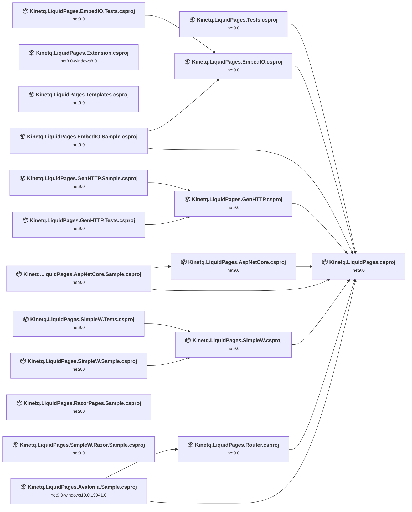

## Project Details

### src\Kinetq.LiquidPages.AspNetCore.Sample\Kinetq.LiquidPages.AspNetCore.Sample.csproj

#### Project Info

- **Current Target Framework:** net9.0
- **Proposed Target Framework:** net10.0
- **SDK-style**: True
- **Project Kind:** AspNetCore
- **Dependencies**: 2
- **Dependants**: 0
- **Number of Files**: 16
- **Number of Files with Incidents**: 1
- **Lines of Code**: 72
- **Estimated LOC to modify**: 0+ (at least 0.0% of the project)

#### Dependency Graph

Legend:
📦 SDK-style project
⚙️ Classic project

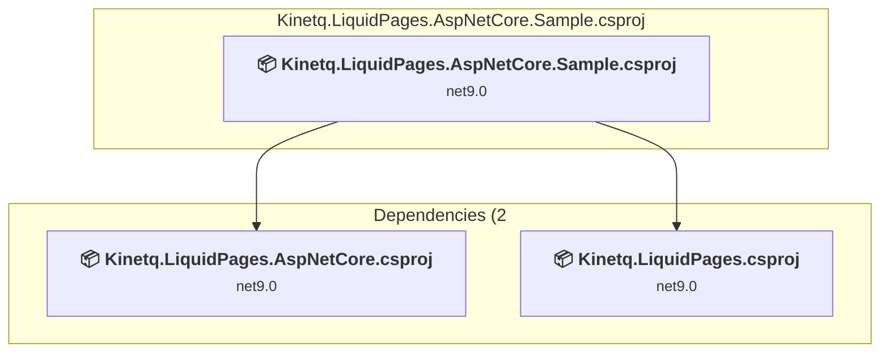

### API Compatibility

| Category | Count | Impact |
| :--- | :---: | :--- |
| 🔴 Binary Incompatible | 0 | High - Require code changes |
| 🟡 Source Incompatible | 0 | Medium - Needs re-compilation and potential conflicting API error fixing |
| 🔵 Behavioral change | 0 | Low - Behavioral changes that may require testing at runtime |
| ✅ Compatible | 62 |  |
| ***Total APIs Analyzed*** | ***62*** |  |

### src\Kinetq.LiquidPages.AspNetCore\Kinetq.LiquidPages.AspNetCore.csproj

#### Project Info

- **Current Target Framework:** net9.0
- **Proposed Target Framework:** net10.0
- **SDK-style**: True
- **Project Kind:** ClassLibrary
- **Dependencies**: 1
- **Dependants**: 1
- **Number of Files**: 3
- **Number of Files with Incidents**: 2
- **Lines of Code**: 147
- **Estimated LOC to modify**: 1+ (at least 0.7% of the project)

#### Dependency Graph

Legend:
📦 SDK-style project
⚙️ Classic project

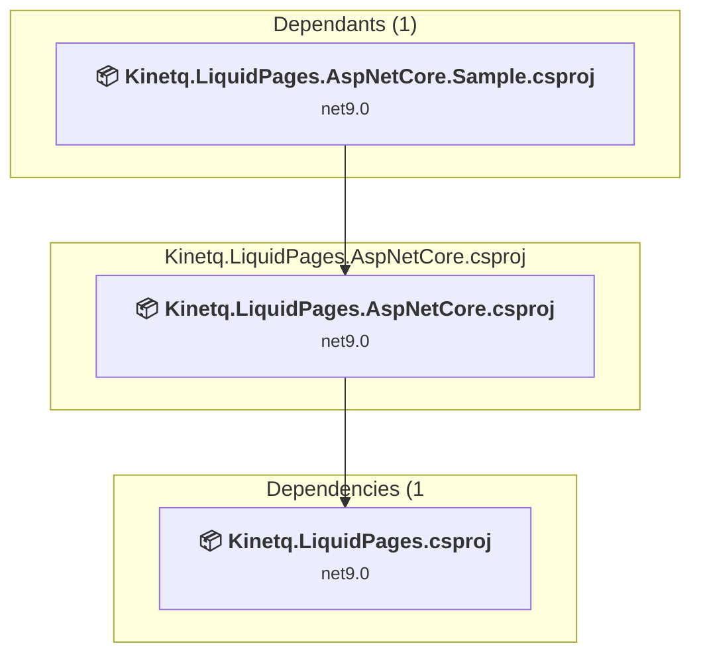

### API Compatibility

| Category | Count | Impact |
| :--- | :---: | :--- |
| 🔴 Binary Incompatible | 0 | High - Require code changes |
| 🟡 Source Incompatible | 0 | Medium - Needs re-compilation and potential conflicting API error fixing |
| 🔵 Behavioral change | 1 | Low - Behavioral changes that may require testing at runtime |
| ✅ Compatible | 169 |  |
| ***Total APIs Analyzed*** | ***170*** |  |

### src\Kinetq.LiquidPages.Avalonia.Sample\Kinetq.LiquidPages.Avalonia.Sample.csproj

#### Project Info

- **Current Target Framework:** net9.0-windows10.0.19041.0
- **Proposed Target Framework:** net10.0-windows
- **SDK-style**: True
- **Project Kind:** WinForms
- **Dependencies**: 2
- **Dependants**: 0
- **Number of Files**: 20
- **Number of Files with Incidents**: 15
- **Lines of Code**: 449
- **Estimated LOC to modify**: 113+ (at least 25.2% of the project)

#### Dependency Graph

Legend:
📦 SDK-style project
⚙️ Classic project

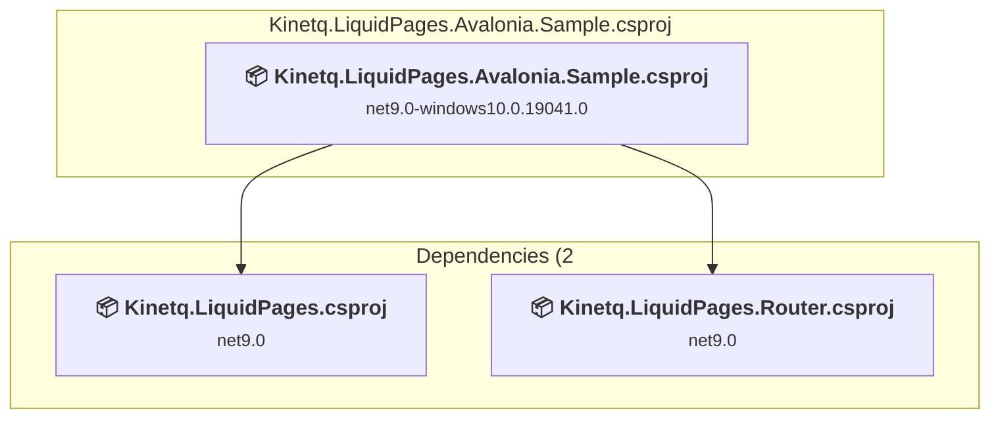

### API Compatibility

| Category | Count | Impact |
| :--- | :---: | :--- |
| 🔴 Binary Incompatible | 0 | High - Require code changes |
| 🟡 Source Incompatible | 109 | Medium - Needs re-compilation and potential conflicting API error fixing |
| 🔵 Behavioral change | 4 | Low - Behavioral changes that may require testing at runtime |
| ✅ Compatible | 1432 |  |
| ***Total APIs Analyzed*** | ***1545*** |  |

### src\Kinetq.LiquidPages.EmbedIO.Sample\Kinetq.LiquidPages.EmbedIO.Sample.csproj

#### Project Info

- **Current Target Framework:** net9.0
- **Proposed Target Framework:** net10.0
- **SDK-style**: True
- **Project Kind:** DotNetCoreApp
- **Dependencies**: 2
- **Dependants**: 0
- **Number of Files**: 7
- **Number of Files with Incidents**: 2
- **Lines of Code**: 110
- **Estimated LOC to modify**: 1+ (at least 0.9% of the project)

#### Dependency Graph

Legend:
📦 SDK-style project
⚙️ Classic project

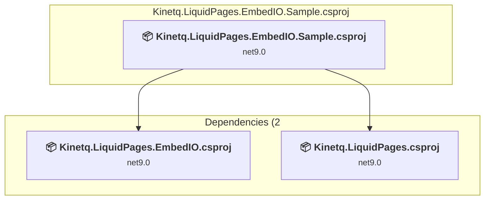

### API Compatibility

| Category | Count | Impact |
| :--- | :---: | :--- |
| 🔴 Binary Incompatible | 0 | High - Require code changes |
| 🟡 Source Incompatible | 0 | Medium - Needs re-compilation and potential conflicting API error fixing |
| 🔵 Behavioral change | 1 | Low - Behavioral changes that may require testing at runtime |
| ✅ Compatible | 93 |  |
| ***Total APIs Analyzed*** | ***94*** |  |

### src\Kinetq.LiquidPages.EmbedIO.Tests\Kinetq.LiquidPages.EmbedIO.Tests.csproj

#### Project Info

- **Current Target Framework:** net9.0
- **Proposed Target Framework:** net10.0
- **SDK-style**: True
- **Project Kind:** DotNetCoreApp
- **Dependencies**: 1
- **Dependants**: 0
- **Number of Files**: 3
- **Number of Files with Incidents**: 1
- **Lines of Code**: 193
- **Estimated LOC to modify**: 0+ (at least 0.0% of the project)

#### Dependency Graph

Legend:
📦 SDK-style project
⚙️ Classic project

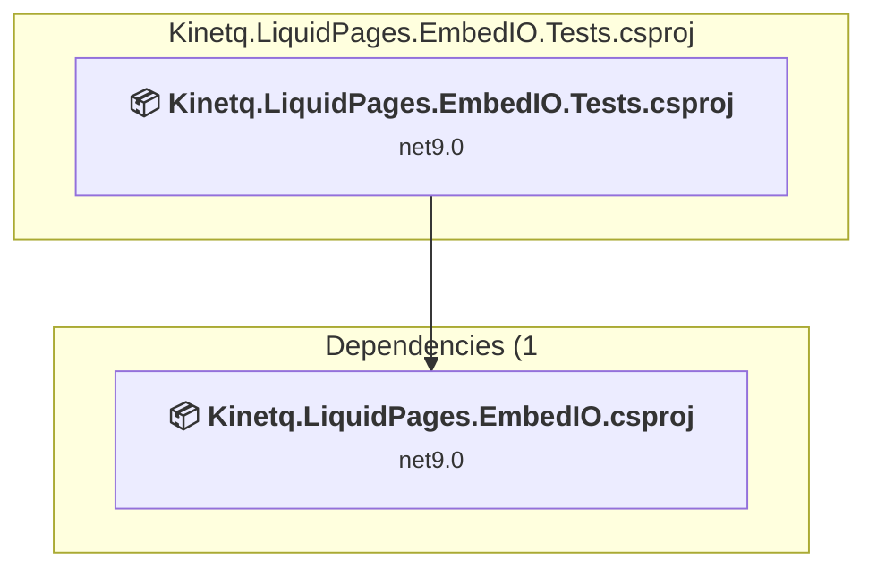

### API Compatibility

| Category | Count | Impact |
| :--- | :---: | :--- |
| 🔴 Binary Incompatible | 0 | High - Require code changes |
| 🟡 Source Incompatible | 0 | Medium - Needs re-compilation and potential conflicting API error fixing |
| 🔵 Behavioral change | 0 | Low - Behavioral changes that may require testing at runtime |
| ✅ Compatible | 300 |  |
| ***Total APIs Analyzed*** | ***300*** |  |

### src\Kinetq.LiquidPages.EmbedIO\Kinetq.LiquidPages.EmbedIO.csproj

#### Project Info

- **Current Target Framework:** net9.0
- **Proposed Target Framework:** net10.0
- **SDK-style**: True
- **Project Kind:** ClassLibrary
- **Dependencies**: 1
- **Dependants**: 2
- **Number of Files**: 4
- **Number of Files with Incidents**: 2
- **Lines of Code**: 183
- **Estimated LOC to modify**: 3+ (at least 1.6% of the project)

#### Dependency Graph

Legend:
📦 SDK-style project
⚙️ Classic project

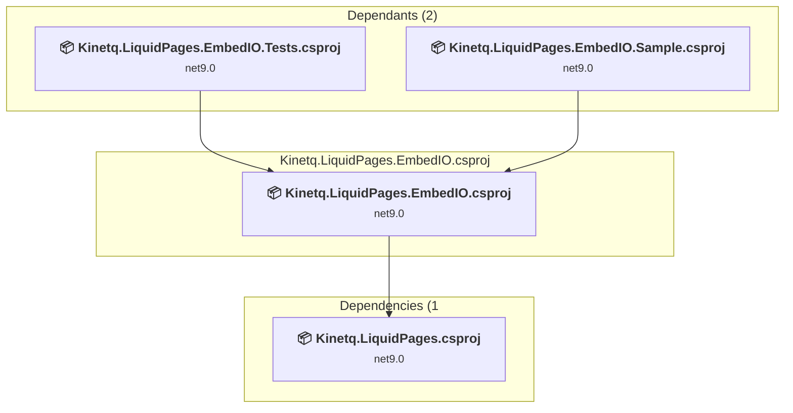

### API Compatibility

| Category | Count | Impact |
| :--- | :---: | :--- |
| 🔴 Binary Incompatible | 0 | High - Require code changes |
| 🟡 Source Incompatible | 0 | Medium - Needs re-compilation and potential conflicting API error fixing |
| 🔵 Behavioral change | 3 | Low - Behavioral changes that may require testing at runtime |
| ✅ Compatible | 201 |  |
| ***Total APIs Analyzed*** | ***204*** |  |

### src\Kinetq.LiquidPages.Extension\Kinetq.LiquidPages.Extension.csproj

#### Project Info

- **Current Target Framework:** net8.0-windows8.0
- **Proposed Target Framework:** net10.0--windows8.0
- **SDK-style**: True
- **Project Kind:** ClassLibrary
- **Dependencies**: 0
- **Dependants**: 0
- **Number of Files**: 24
- **Number of Files with Incidents**: 3
- **Lines of Code**: 1408
- **Estimated LOC to modify**: 11+ (at least 0.8% of the project)

#### Dependency Graph

Legend:
📦 SDK-style project
⚙️ Classic project

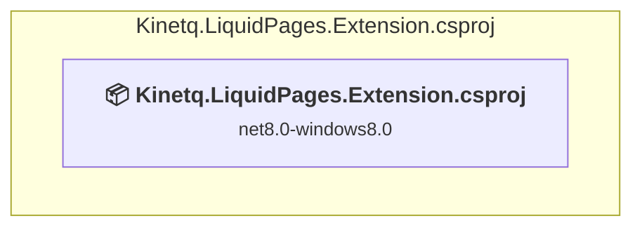

### API Compatibility

| Category | Count | Impact |
| :--- | :---: | :--- |
| 🔴 Binary Incompatible | 0 | High - Require code changes |
| 🟡 Source Incompatible | 0 | Medium - Needs re-compilation and potential conflicting API error fixing |
| 🔵 Behavioral change | 11 | Low - Behavioral changes that may require testing at runtime |
| ✅ Compatible | 1727 |  |
| ***Total APIs Analyzed*** | ***1738*** |  |

### src\Kinetq.LiquidPages.GenHTTP.Sample\Kinetq.LiquidPages.GenHTTP.Sample.csproj

#### Project Info

- **Current Target Framework:** net9.0
- **Proposed Target Framework:** net10.0
- **SDK-style**: True
- **Project Kind:** DotNetCoreApp
- **Dependencies**: 1
- **Dependants**: 0
- **Number of Files**: 9
- **Number of Files with Incidents**: 2
- **Lines of Code**: 140
- **Estimated LOC to modify**: 1+ (at least 0.7% of the project)

#### Dependency Graph

Legend:
📦 SDK-style project
⚙️ Classic project

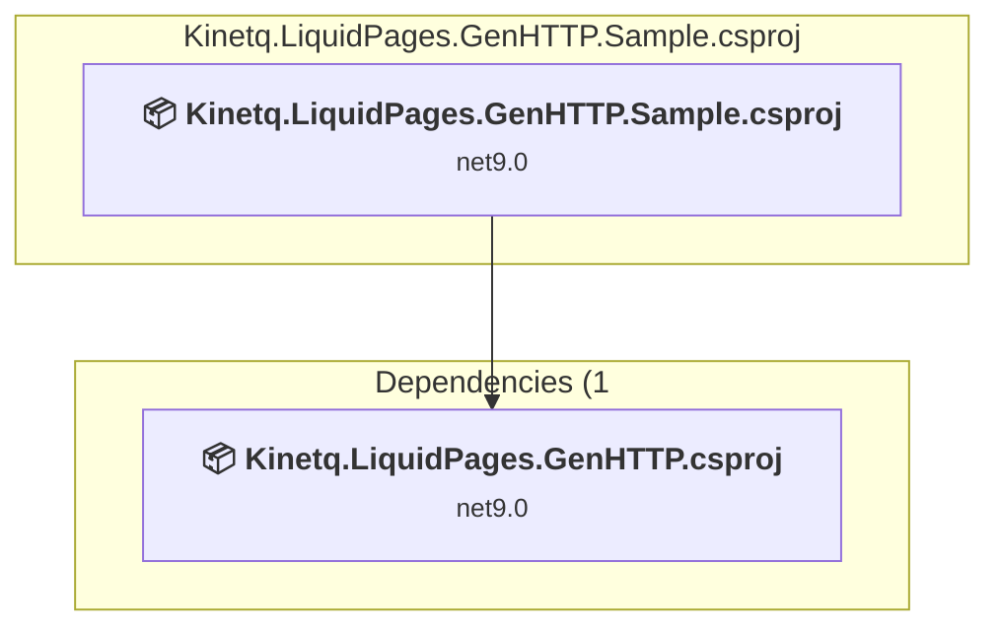

### API Compatibility

| Category | Count | Impact |
| :--- | :---: | :--- |
| 🔴 Binary Incompatible | 0 | High - Require code changes |
| 🟡 Source Incompatible | 0 | Medium - Needs re-compilation and potential conflicting API error fixing |
| 🔵 Behavioral change | 1 | Low - Behavioral changes that may require testing at runtime |
| ✅ Compatible | 140 |  |
| ***Total APIs Analyzed*** | ***141*** |  |

### src\Kinetq.LiquidPages.GenHTTP.Tests\Kinetq.LiquidPages.GenHTTP.Tests.csproj

#### Project Info

- **Current Target Framework:** net9.0
- **Proposed Target Framework:** net10.0
- **SDK-style**: True
- **Project Kind:** DotNetCoreApp
- **Dependencies**: 1
- **Dependants**: 0
- **Number of Files**: 3
- **Number of Files with Incidents**: 1
- **Lines of Code**: 237
- **Estimated LOC to modify**: 0+ (at least 0.0% of the project)

#### Dependency Graph

Legend:
📦 SDK-style project
⚙️ Classic project

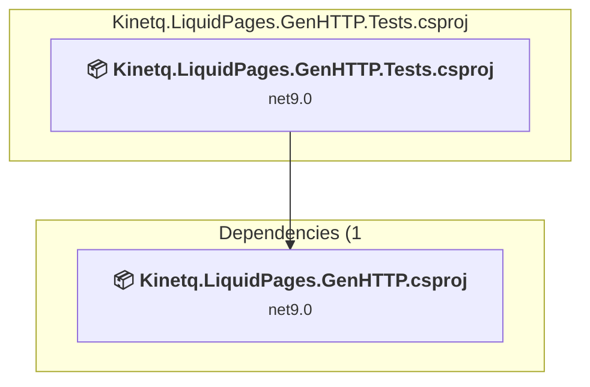

### API Compatibility

| Category | Count | Impact |
| :--- | :---: | :--- |
| 🔴 Binary Incompatible | 0 | High - Require code changes |
| 🟡 Source Incompatible | 0 | Medium - Needs re-compilation and potential conflicting API error fixing |
| 🔵 Behavioral change | 0 | Low - Behavioral changes that may require testing at runtime |
| ✅ Compatible | 426 |  |
| ***Total APIs Analyzed*** | ***426*** |  |

### src\Kinetq.LiquidPages.GenHTTP\Kinetq.LiquidPages.GenHTTP.csproj

#### Project Info

- **Current Target Framework:** net9.0
- **Proposed Target Framework:** net10.0
- **SDK-style**: True
- **Project Kind:** ClassLibrary
- **Dependencies**: 1
- **Dependants**: 2
- **Number of Files**: 6
- **Number of Files with Incidents**: 2
- **Lines of Code**: 311
- **Estimated LOC to modify**: 2+ (at least 0.6% of the project)

#### Dependency Graph

Legend:
📦 SDK-style project
⚙️ Classic project

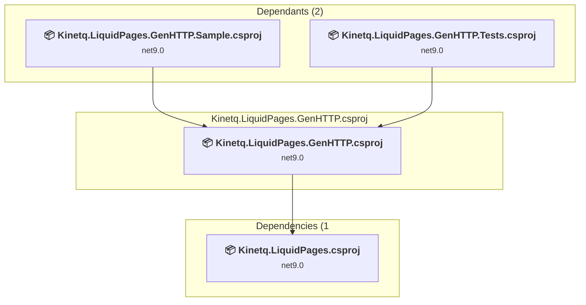

### API Compatibility

| Category | Count | Impact |
| :--- | :---: | :--- |
| 🔴 Binary Incompatible | 0 | High - Require code changes |
| 🟡 Source Incompatible | 0 | Medium - Needs re-compilation and potential conflicting API error fixing |
| 🔵 Behavioral change | 2 | Low - Behavioral changes that may require testing at runtime |
| ✅ Compatible | 304 |  |
| ***Total APIs Analyzed*** | ***306*** |  |

### src\Kinetq.LiquidPages.RazorPages.Sample\Kinetq.LiquidPages.RazorPages.Sample.csproj

#### Project Info

- **Current Target Framework:** net9.0
- **Proposed Target Framework:** net10.0
- **SDK-style**: True
- **Project Kind:** AspNetCore
- **Dependencies**: 0
- **Dependants**: 0
- **Number of Files**: 17
- **Number of Files with Incidents**: 2
- **Lines of Code**: 194
- **Estimated LOC to modify**: 1+ (at least 0.5% of the project)

#### Dependency Graph

Legend:
📦 SDK-style project
⚙️ Classic project

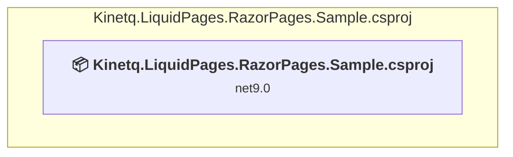

### API Compatibility

| Category | Count | Impact |
| :--- | :---: | :--- |
| 🔴 Binary Incompatible | 0 | High - Require code changes |
| 🟡 Source Incompatible | 0 | Medium - Needs re-compilation and potential conflicting API error fixing |
| 🔵 Behavioral change | 1 | Low - Behavioral changes that may require testing at runtime |
| ✅ Compatible | 1163 |  |
| ***Total APIs Analyzed*** | ***1164*** |  |

### src\Kinetq.LiquidPages.Router\Kinetq.LiquidPages.Router.csproj

#### Project Info

- **Current Target Framework:** net9.0
- **Proposed Target Framework:** net10.0
- **SDK-style**: True
- **Project Kind:** ClassLibrary
- **Dependencies**: 1
- **Dependants**: 1
- **Number of Files**: 7
- **Number of Files with Incidents**: 1
- **Lines of Code**: 193
- **Estimated LOC to modify**: 0+ (at least 0.0% of the project)

#### Dependency Graph

Legend:
📦 SDK-style project
⚙️ Classic project

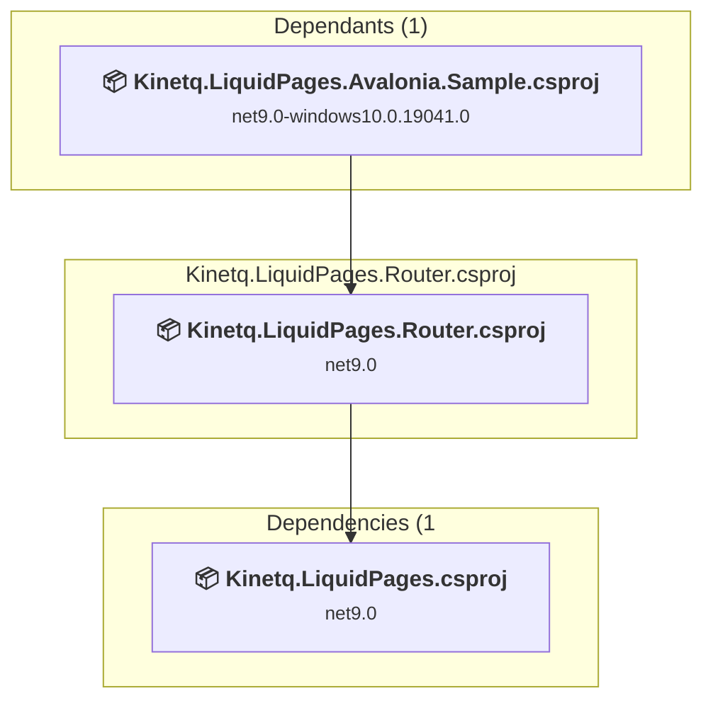

### API Compatibility

| Category | Count | Impact |
| :--- | :---: | :--- |
| 🔴 Binary Incompatible | 0 | High - Require code changes |
| 🟡 Source Incompatible | 0 | Medium - Needs re-compilation and potential conflicting API error fixing |
| 🔵 Behavioral change | 0 | Low - Behavioral changes that may require testing at runtime |
| ✅ Compatible | 153 |  |
| ***Total APIs Analyzed*** | ***153*** |  |

### src\Kinetq.LiquidPages.SimpleW.Razor.Sample\Kinetq.LiquidPages.SimpleW.Razor.Sample.csproj

#### Project Info

- **Current Target Framework:** net9.0
- **Proposed Target Framework:** net10.0
- **SDK-style**: True
- **Project Kind:** DotNetCoreApp
- **Dependencies**: 0
- **Dependants**: 0
- **Number of Files**: 5
- **Number of Files with Incidents**: 2
- **Lines of Code**: 68
- **Estimated LOC to modify**: 1+ (at least 1.5% of the project)

#### Dependency Graph

Legend:
📦 SDK-style project
⚙️ Classic project

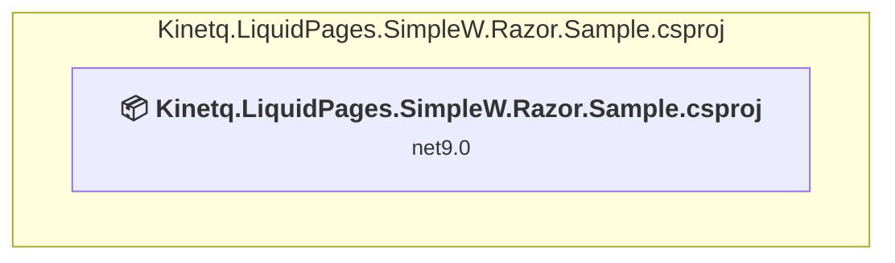

### API Compatibility

| Category | Count | Impact |
| :--- | :---: | :--- |
| 🔴 Binary Incompatible | 0 | High - Require code changes |
| 🟡 Source Incompatible | 1 | Medium - Needs re-compilation and potential conflicting API error fixing |
| 🔵 Behavioral change | 0 | Low - Behavioral changes that may require testing at runtime |
| ✅ Compatible | 51 |  |
| ***Total APIs Analyzed*** | ***52*** |  |

### src\Kinetq.LiquidPages.SimpleW.Sample\Kinetq.LiquidPages.SimpleW.Sample.csproj

#### Project Info

- **Current Target Framework:** net9.0
- **Proposed Target Framework:** net10.0
- **SDK-style**: True
- **Project Kind:** DotNetCoreApp
- **Dependencies**: 1
- **Dependants**: 0
- **Number of Files**: 7
- **Number of Files with Incidents**: 2
- **Lines of Code**: 117
- **Estimated LOC to modify**: 2+ (at least 1.7% of the project)

#### Dependency Graph

Legend:
📦 SDK-style project
⚙️ Classic project

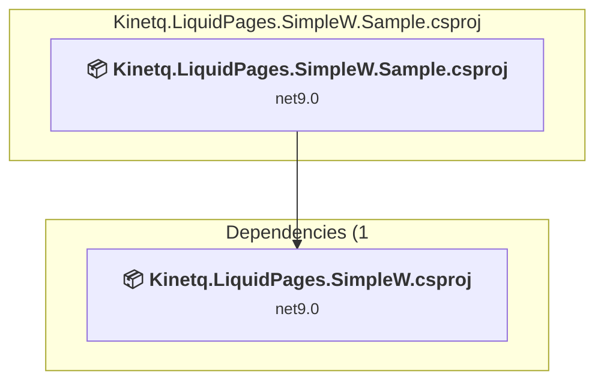

### API Compatibility

| Category | Count | Impact |
| :--- | :---: | :--- |
| 🔴 Binary Incompatible | 0 | High - Require code changes |
| 🟡 Source Incompatible | 1 | Medium - Needs re-compilation and potential conflicting API error fixing |
| 🔵 Behavioral change | 1 | Low - Behavioral changes that may require testing at runtime |
| ✅ Compatible | 121 |  |
| ***Total APIs Analyzed*** | ***123*** |  |

### src\Kinetq.LiquidPages.SimpleW.Tests\Kinetq.LiquidPages.SimpleW.Tests.csproj

#### Project Info

- **Current Target Framework:** net9.0
- **Proposed Target Framework:** net10.0
- **SDK-style**: True
- **Project Kind:** DotNetCoreApp
- **Dependencies**: 1
- **Dependants**: 0
- **Number of Files**: 3
- **Number of Files with Incidents**: 1
- **Lines of Code**: 226
- **Estimated LOC to modify**: 0+ (at least 0.0% of the project)

#### Dependency Graph

Legend:
📦 SDK-style project
⚙️ Classic project

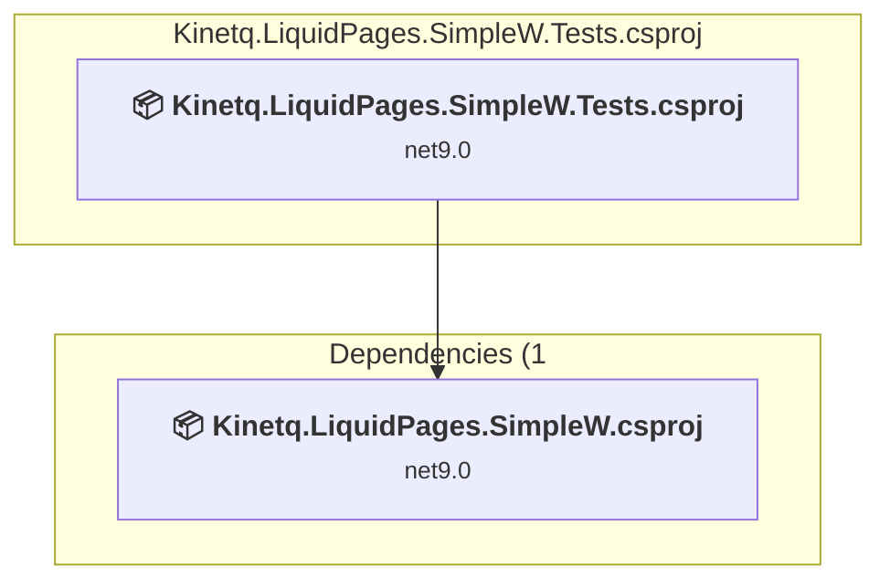

### API Compatibility

| Category | Count | Impact |
| :--- | :---: | :--- |
| 🔴 Binary Incompatible | 0 | High - Require code changes |
| 🟡 Source Incompatible | 0 | Medium - Needs re-compilation and potential conflicting API error fixing |
| 🔵 Behavioral change | 0 | Low - Behavioral changes that may require testing at runtime |
| ✅ Compatible | 406 |  |
| ***Total APIs Analyzed*** | ***406*** |  |

### src\Kinetq.LiquidPages.SimpleW\Kinetq.LiquidPages.SimpleW.csproj

#### Project Info

- **Current Target Framework:** net9.0
- **Proposed Target Framework:** net10.0
- **SDK-style**: True
- **Project Kind:** ClassLibrary
- **Dependencies**: 1
- **Dependants**: 2
- **Number of Files**: 3
- **Number of Files with Incidents**: 1
- **Lines of Code**: 187
- **Estimated LOC to modify**: 0+ (at least 0.0% of the project)

#### Dependency Graph

Legend:
📦 SDK-style project
⚙️ Classic project

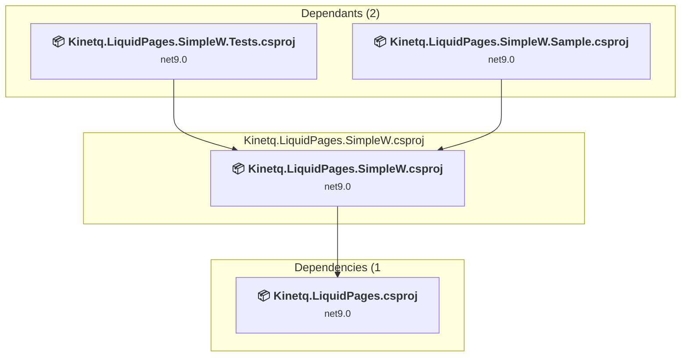

### API Compatibility

| Category | Count | Impact |
| :--- | :---: | :--- |
| 🔴 Binary Incompatible | 0 | High - Require code changes |
| 🟡 Source Incompatible | 0 | Medium - Needs re-compilation and potential conflicting API error fixing |
| 🔵 Behavioral change | 0 | Low - Behavioral changes that may require testing at runtime |
| ✅ Compatible | 185 |  |
| ***Total APIs Analyzed*** | ***185*** |  |

### src\Kinetq.LiquidPages.Templates\Kinetq.LiquidPages.Templates.csproj

#### Project Info

- **Current Target Framework:** net9.0
- **Proposed Target Framework:** net10.0
- **SDK-style**: True
- **Project Kind:** ClassLibrary
- **Dependencies**: 0
- **Dependants**: 0
- **Number of Files**: 10
- **Number of Files with Incidents**: 1
- **Lines of Code**: 0
- **Estimated LOC to modify**: 0+ (at least 0.0% of the project)

#### Dependency Graph

Legend:
📦 SDK-style project
⚙️ Classic project

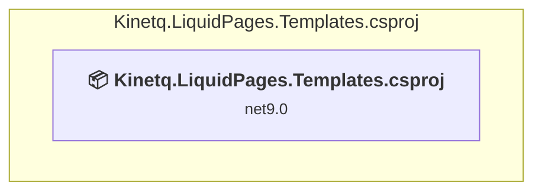

### API Compatibility

| Category | Count | Impact |
| :--- | :---: | :--- |
| 🔴 Binary Incompatible | 0 | High - Require code changes |
| 🟡 Source Incompatible | 0 | Medium - Needs re-compilation and potential conflicting API error fixing |
| 🔵 Behavioral change | 0 | Low - Behavioral changes that may require testing at runtime |
| ✅ Compatible | 0 |  |
| ***Total APIs Analyzed*** | ***0*** |  |

### src\Kinetq.LiquidPages.Tests\Kinetq.LiquidPages.Tests.csproj

#### Project Info

- **Current Target Framework:** net9.0
- **Proposed Target Framework:** net10.0
- **SDK-style**: True
- **Project Kind:** DotNetCoreApp
- **Dependencies**: 1
- **Dependants**: 0
- **Number of Files**: 22
- **Number of Files with Incidents**: 4
- **Lines of Code**: 1181
- **Estimated LOC to modify**: 4+ (at least 0.3% of the project)

#### Dependency Graph

Legend:
📦 SDK-style project
⚙️ Classic project

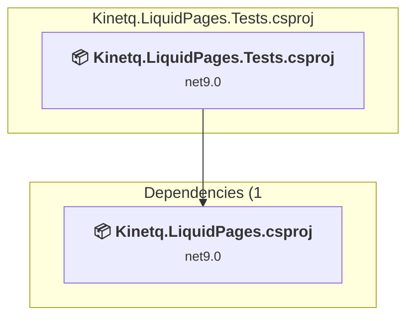

### API Compatibility

| Category | Count | Impact |
| :--- | :---: | :--- |
| 🔴 Binary Incompatible | 0 | High - Require code changes |
| 🟡 Source Incompatible | 0 | Medium - Needs re-compilation and potential conflicting API error fixing |
| 🔵 Behavioral change | 4 | Low - Behavioral changes that may require testing at runtime |
| ✅ Compatible | 1502 |  |
| ***Total APIs Analyzed*** | ***1506*** |  |

### src\Kinetq.LiquidPages\Kinetq.LiquidPages.csproj

#### Project Info

- **Current Target Framework:** net9.0
- **Proposed Target Framework:** net10.0
- **SDK-style**: True
- **Project Kind:** ClassLibrary
- **Dependencies**: 0
- **Dependants**: 9
- **Number of Files**: 41
- **Number of Files with Incidents**: 2
- **Lines of Code**: 1214
- **Estimated LOC to modify**: 2+ (at least 0.2% of the project)

#### Dependency Graph

Legend:
📦 SDK-style project
⚙️ Classic project

```mermaid
flowchart TB
    subgraph upstream["Dependants (9)"]
        P2["<b>📦&nbsp;Kinetq.LiquidPages.Tests.csproj</b><br/><small>net9.0</small>"]
        P3["<b>📦&nbsp;Kinetq.LiquidPages.EmbedIO.csproj</b><br/><small>net9.0</small>"]
        P7["<b>📦&nbsp;Kinetq.LiquidPages.EmbedIO.Sample.csproj</b><br/><small>net9.0</small>"]
        P8["<b>📦&nbsp;Kinetq.LiquidPages.GenHTTP.csproj</b><br/><small>net9.0</small>"]
        P11["<b>📦&nbsp;Kinetq.LiquidPages.AspNetCore.csproj</b><br/><small>net9.0</small>"]
        P12["<b>📦&nbsp;Kinetq.LiquidPages.AspNetCore.Sample.csproj</b><br/><small>net9.0</small>"]
        P13["<b>📦&nbsp;Kinetq.LiquidPages.SimpleW.csproj</b><br/><small>net9.0</small>"]
        P18["<b>📦&nbsp;Kinetq.LiquidPages.Router.csproj</b><br/><small>net9.0</small>"]
        P19["<b>📦&nbsp;Kinetq.LiquidPages.Avalonia.Sample.csproj</b><br/><small>net9.0-windows10.0.19041.0</small>"]
        click P2 "#srckinetqliquidpagestestskinetqliquidpagestestscsproj"
        click P3 "#srckinetqliquidpagesembediokinetqliquidpagesembediocsproj"
        click P7 "#srckinetqliquidpagesembediosamplekinetqliquidpagesembediosamplecsproj"
        click P8 "#srckinetqliquidpagesgenhttpkinetqliquidpagesgenhttpcsproj"
        click P11 "#srckinetqliquidpagesaspnetcorekinetqliquidpagesaspnetcorecsproj"
        click P12 "#srckinetqliquidpagesaspnetcoresamplekinetqliquidpagesaspnetcoresamplecsproj"
        click P13 "#srckinetqliquidpagessimplewkinetqliquidpagessimplewcsproj"
        click P18 "#srckinetqliquidpagesrouterkinetqliquidpagesroutercsproj"
        click P19 "#srckinetqliquidpagesavaloniasamplekinetqliquidpagesavaloniasamplecsproj"
    end
    subgraph current["Kinetq.LiquidPages.csproj"]
        MAIN["<b>📦&nbsp;Kinetq.LiquidPages.csproj</b><br/><small>net9.0</small>"]
        click MAIN "#srckinetqliquidpageskinetqliquidpagescsproj"
    end
    P2 --> MAIN
    P3 --> MAIN
    P7 --> MAIN
    P8 --> MAIN
    P11 --> MAIN
    P12 --> MAIN
    P13 --> MAIN
    P18 --> MAIN
    P19 --> MAIN

```

### API Compatibility

| Category | Count | Impact |
| :--- | :---: | :--- |
| 🔴 Binary Incompatible | 0 | High - Require code changes |
| 🟡 Source Incompatible | 0 | Medium - Needs re-compilation and potential conflicting API error fixing |
| 🔵 Behavioral change | 2 | Low - Behavioral changes that may require testing at runtime |
| ✅ Compatible | 1015 |  |
| ***Total APIs Analyzed*** | ***1017*** |  |

