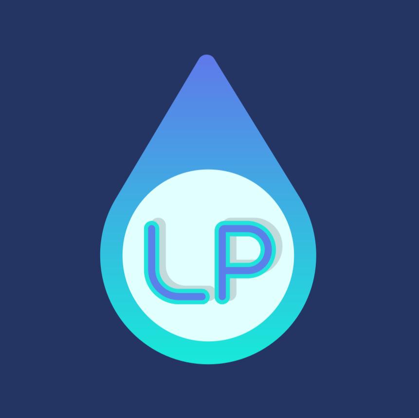

# Liquid Pages
[](https://github.com/kinetq/liquid-middleware/actions/workflows/main.yml)


[](https://www.kinetq.com/docs/open-source-software/liquid-pages)
<p align="center">
  
</p>

LiquidPages is an open-source C# library that brings a Razor Pages–style MVVM framework to [Liquid](https://shopify.github.io/liquid/) templates. It uses [Fluid](https://github.com/sebastienros/fluid) under the hood and is designed to plug into virtually any .NET web server.

## Why?

Most .NET templating solutions are tightly coupled to a specific web server or framework. LiquidPages was built to solve two problems:

- **Web-server agnostic** — the middleware can hook into any web server (EmbedIO, a custom HTTP listener, or anything else you can hand a request to), so you aren't locked into a particular host.
- **Modular by design** — Liquid templates and their page models can live in any C# project across a solution. Each route defines its own `IFileProvider`, making it straightforward to split pages across multiple projects and compose them at runtime.

The result is a lightweight, portable templating layer that stays out of your way regardless of how your application is structured.

## Setup

### 1. Install the NuGet package

```powershell
nuget add Kinetq.LiquidPages
```

### 2. Register services

```csharp
services.AddLiquidPages();
```

### 3. Register routes and filters at startup

Inject `ILiquidStartup` and call the registration methods during your application's startup phase:

```csharp
await _liquidStartup.RegisterPageModels();
await _liquidStartup.RegisterFilters();
```

### 4. Create a page model

Decorate your page model with `[LiquidPage]`, providing a route regex and template path:

```csharp
[LiquidPage("^/$", "Pages/Home.liquid")]
public class HomeModel : LiquidPageModel
{
    public string Title { get; set; } = "Welcome to Home";

    public override Task OnGetAsync(LiquidRequestModel request)
    {
        return Task.CompletedTask;
    }
}
```

### 5. Create the Liquid template

Properties on the page model are available in the template via the `view_model` object:

```liquid

    <h1>{{ view_model.title }}</h1>



```

### 6. Wire up middleware

#### GenHTTP

Install the GenHTTP companion package:

```powershell
dotnet add package Kinetq.LiquidPages.GenHTTP
```

Resolve `ILiquidResponseMiddleware` from your container and pass it to `LiquidHandlerBuilder`:

```csharp
var middleware = serviceProvider.GetRequiredService<ILiquidResponseMiddleware>();

await Host.Create()
          .Handler(new LiquidHandlerBuilder(middleware))
          .Bind(IPAddress.Any, 8080)
          .RunAsync();
```

`LiquidHandlerBuilder` implements `IHandlerBuilder<LiquidHandlerBuilder>`, so you can attach any GenHTTP concern (compression, caching, CORS, etc.) before the handler is built. See the [full GenHTTP documentation](docs/genhttp-liquid-pages.md) for a complete walkthrough.

#### EmbedIO

Install the EmbedIO companion package and add the module to your web server:

```powershell
dotnet add package Kinetq.LiquidPages.EmbedIO
```

```csharp
var liquidWebModule = new LiquidWebModule("/")
{
    LiquidResponseMiddleware = _liquidResponseMiddleware,
    ExcludedPaths = new Regex[]
    {
        new Regex("^/api/.*"),
        new Regex("^/static/.*")
    }
};

webServer.WithModule(liquidWebModule);
```

#### ASP.NET Core

Install the ASP.NET Core companion package:

```powershell
dotnet add package Kinetq.LiquidPages.AspNetCore
```

Register LiquidPages services and initialize page models in `Program.cs`, then add the middleware to the pipeline:

```csharp
using Kinetq.LiquidPages.AspNetCore;
using Kinetq.LiquidPages.Helpers;
using Kinetq.LiquidPages.Interfaces;

var builder = WebApplication.CreateBuilder(args);

builder.Services.AddLiquidPages(typeof(Program).Assembly);

var app = builder.Build();

using (var scope = app.Services.CreateScope())
{
    var startup = scope.ServiceProvider.GetRequiredService<ILiquidStartup>();
    await startup.RegisterPageModels();
}

app.UseLiquidPages();

await app.RunAsync();
```

For other web servers, call `HandleRequestAsync` on `ILiquidResponseMiddleware` from within your own request handler.

## Visual Studio Extension

Install the `Kinetq.LiquidPages.Extension` from the Visual Studio Marketplace for syntax highlighting, a Prettier-based formatter (`Ctrl+Shift+X`), and quick commands to scaffold new pages.

Before using the **Add LiquidPage** command, install the templates package:

```powershell
dotnet new install Kinetq.LiquidPages.Templates
```

The extension automatically adds a `.filenesting.json` to your project, which nests `.liquid.cs` code-behind files under their corresponding `.liquid` template in Solution Explorer.

### Without the extension

If you choose not to use the extension, you will need to configure the following manually.

**`.filenesting.json`** — add this to your project root to nest `.liquid.cs` files under their `.liquid` counterparts:

```json
{
  "root": true,
  "dependentFileProviders": {
    "add": {
      "extensionToExtension": {
        "add": {
          ".liquid.cs": [ ".liquid" ]
        }
      }
    }
  }
}
```

**`.vs/VSWorkspaceSettings.json`** — add this to suppress HTML validation warnings inside `.liquid` files and enable HTML syntax highlighting for them in Visual Studio:

```json
{
  "HtmlValidation.IgnorePatterns": [
    "**/*.liquid"
  ],
  "Files.Associations": {
    "*.liquid": "html"
  }
}
```

## Documentation

Full documentation: https://www.kinetq.com/docs/open-source-software/liquid-pages

If you find this project helpful, please consider giving it a ⭐!